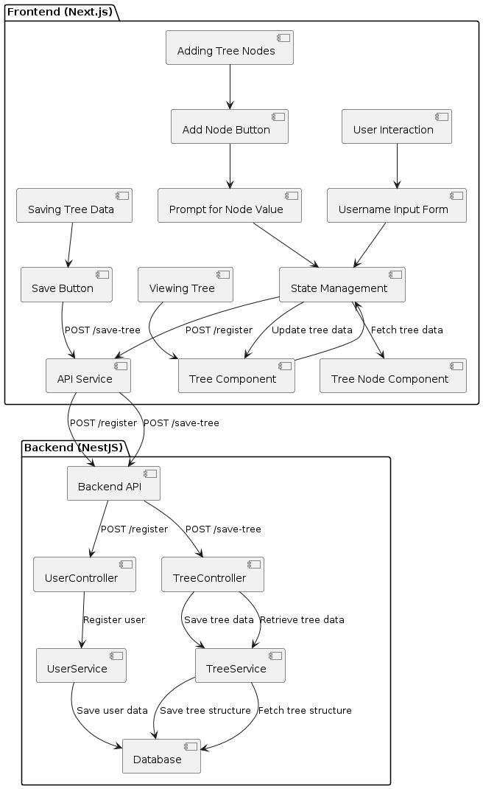
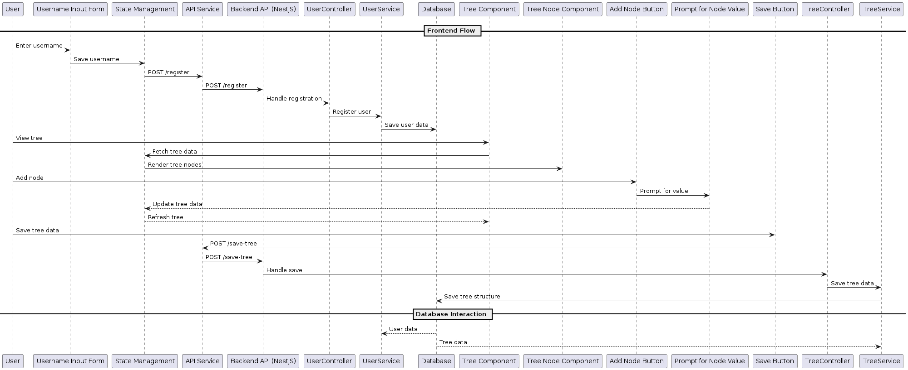

<p align="center">
  <a href="http://nestjs.com/" target="blank"></a>
</p>

[circleci-image]: https://img.shields.io/circleci/build/github/nestjs/nest/master?token=abc123def456
[circleci-url]: https://circleci.com/gh/nestjs/nest

  <p align="center">A progressive <a href="http://nodejs.org" target="_blank">Node.js</a> framework for building efficient and scalable server-side applications.</p>
    <p align="center">
<a href="https://www.npmjs.com/~nestjscore" target="_blank"></a>
<a href="https://www.npmjs.com/~nestjscore" target="_blank"></a>
<a href="https://www.npmjs.com/~nestjscore" target="_blank"></a>
<a href="https://circleci.com/gh/nestjs/nest" target="_blank"></a>
<a href="https://coveralls.io/github/nestjs/nest?branch=master" target="_blank"></a>
<a href="https://discord.gg/G7Qnnhy" target="_blank"></a>
<a href="https://opencollective.com/nest#backer" target="_blank"></a>
<a href="https://opencollective.com/nest#sponsor" target="_blank"></a>
  <a href="https://paypal.me/kamilmysliwiec" target="_blank"></a>
    <a href="https://opencollective.com/nest#sponsor"  target="_blank"></a>
  <a href="https://twitter.com/nestframework" target="_blank"></a>
</p>
  <!--[](https://opencollective.com/nest#backer)
  [](https://opencollective.com/nest#sponsor)-->

## Description

[Nest](https://github.com/nestjs/nest) framework TypeScript starter repository.

## Installation

```bash
$ npm install
```

## Running the app

```bash
# development
$ npm run start

# watch mode
$ npm run start:dev

# production mode
$ npm run start:prod
```

## Test

```bash
# unit tests
$ npm run test

# e2e tests
$ npm run test:e2e

# test coverage
$ npm run test:cov
```

# Deep Tree Implementation with Next.js and NestJS

## Overview
This project implements a full-stack web application for managing and persisting a hierarchical tree structure using Next.js for the frontend and NestJS for the backend. The goal is to handle a tree with a depth of 10,000 nodes efficiently.

## Technologies Used
- **Frontend**: Next.js, React, TypeScript
- **Backend**: NestJS, TypeScript, MongoDB (or your preferred database)
- **State Management**: React Context API
- **Styling**: CSS Modules
- **Deployment**: Docker (optional), Heroku (or your preferred hosting platform)

## Project Structure
The project is structured as follows:

```
deep-tree/
├── backend/          # NestJS Backend
│   ├── src/
│   │   ├── users/    # User management module
│   │   ├── tree/     # Tree management module
│   │   ├── app.module.ts
│   │   ├── main.ts
│   ├── package.json
│   ├── tsconfig.json
├── frontend/         # Next.js Frontend
│   ├── pages/
│   │   ├── index.tsx # Main page
│   ├── components/
│   │   ├── TreeNode.tsx
│   │   ├── Tree.tsx
│   ├── public/
│   ├── package.json
│   ├── tsconfig.json
├── .gitignore
├── README.md         # Project documentation
```
## Flowchart



This flowchart illustrates the workflow of the project.

## UseCase



This flowchart illustrates the workflow of the project.


## Setup and Installation
To run the project locally, follow these steps:

### Prerequisites
- Node.js and npm installed
- MongoDB installed and running (or your preferred database)

### Backend Setup
1. Navigate to the `backend/` directory:
   ```
   cd backend
   ```
2. Install dependencies:
   ```
   npm install
   ```
3. Set up environment variables:
   - Create a `.env` file based on `.env.example` and configure your MongoDB URI.

4. Start the NestJS server:
   ```
   npm run start:dev
   ```

### Frontend Setup
1. Navigate to the `frontend/` directory:
   ```
   cd frontend
   ```
2. Install dependencies:
   ```
   npm install
   ```
3. Start the Next.js development server:
   ```
   npm run dev
   ```
4. Open your browser and go to `http://localhost:3000` to view the application.

## Methodology

### Project Approach

The Deep Tree Implementation project follows a structured approach to develop a full-stack web application using Next.js and NestJS. The methodology integrates best practices in software development, ensuring robustness, scalability, and maintainability.

#### Agile Development

The project adopts Agile principles to facilitate iterative development and continuous improvement:

- **Sprints**: Organized into two-week sprints to achieve incremental progress and deliverables.
- **Daily Standups**: Conducted to review progress, discuss challenges, and plan the day's tasks.
- **Backlog Management**: Maintained to prioritize tasks and features based on user stories and project milestones.

### Detailed Steps

#### 1. Initial Setup

- **Next.js Setup**: Created a new Next.js project to serve as the frontend platform.
- **NestJS Setup**: Initialized a NestJS project for backend development.
- **Version Control**: Set up Git repository for collaborative version management.

#### 2. Frontend Structure

- **Component Development**: Implemented essential components like `TreeNode` and `Tree` using React.
- **User Interface**: Designed and integrated UI elements using CSS Modules for styling.

#### 3. Backend Architecture

- **NestJS Structure**: Established the basic project structure for efficient module management.
- **Database Integration**: Integrated MongoDB for data persistence, designed schemas for users and tree structures.

#### 4. Tree Data Management

- **Data Structure**: Implemented a hierarchical tree data structure capable of handling up to 10,000 nodes.
- **State Management**: Leveraged React Context API for managing complex state interactions across components.

#### 5. API Development

- **User Management APIs**: Developed API endpoints to manage user authentication, registration, and validation.
- **Tree Management APIs**: Implemented endpoints for saving and retrieving tree structures associated with user accounts.

#### 6. Frontend-Backend Integration

- **Secure Communication**: Established secure communication channels between frontend and backend using HTTPS.
- **API Consumption**: Implemented logic to send and receive data between frontend components and backend APIs.

#### 7. Performance Optimization

- **Efficiency Measures**: Optimized both frontend and backend code to ensure smooth performance with large data sets.
- **Lazy Loading**: Implemented lazy loading techniques in the frontend to improve initial load times.

### Continuous Testing and Deployment

- **Unit Testing**: Conducted unit tests for critical components and APIs using Jest and Supertest.
- **Integration Testing**: Tested interactions between frontend and backend to ensure seamless functionality.
- **Deployment**: Deployed the application on Heroku (or your preferred platform) for continuous integration and delivery.


## Conclusion

The methodology employed in this project ensures a systematic approach to building a scalable and efficient tree management system. By following Agile principles and focusing on iterative development, the project aims to deliver a robust application that meets both functional and performance requirements.


## Contact
For questions or support, please contact [Your Name] at [Your Email].

---

Replace `[Your Name]` and `[Your Email]` with your details. Adjust any specifics like database choices or deployment platforms based on your project's needs. This README provides a clear structure, setup instructions, milestones, and licensing information to help users understand and contribute to your project effectively.

